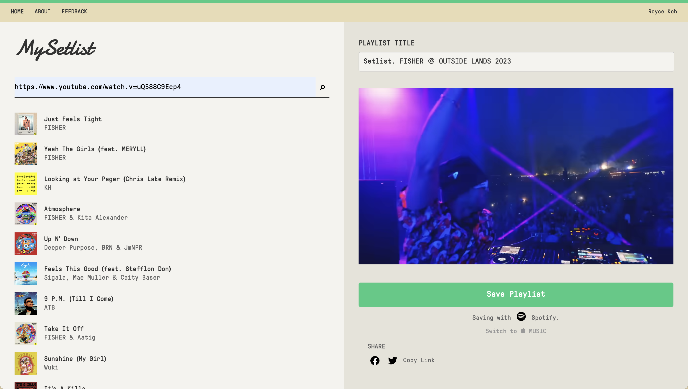
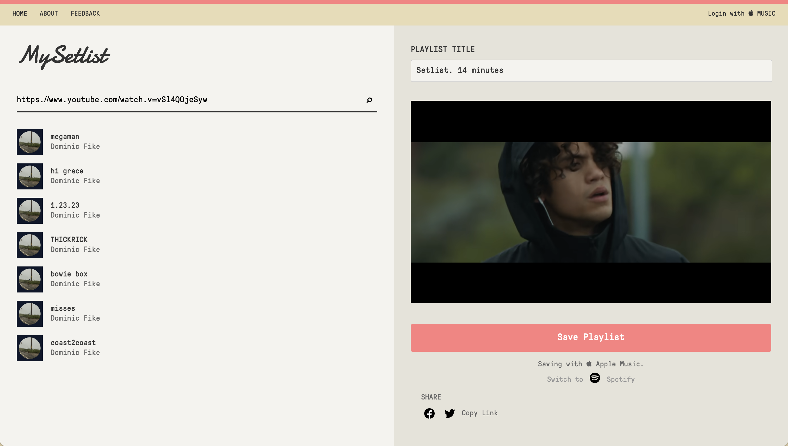

# 🎵 MySetlist

## 🚀 Revolutionizing the Concert Experience

MySetlist is a cutting-edge web application designed to bridge the gap between live music performances and digital playlists. It empowers music enthusiasts to effortlessly create, share, and relive their favorite concert setlists.

---

### 🌟 Key Features

- **Seamless Integration**: Connect with Spotify and Apple Music for a unified music experience.
- **Intuitive Playlist Creation**: Easily build setlists from YouTube videos or manual entry.
- **Smart Search**: Powerful search functionality to find songs and artists quickly.
- **Cross-Platform Compatibility**: Enjoy your setlists on any device, anywhere.
- **Social Sharing**: Share your curated setlists with friends and the MySetlist community.

---

### 💻 Technical Highlights

#### Frontend
- **React**: Leveraging the power of React for a dynamic and responsive UI.
- **Tailwind CSS**: Utilizing utility-first CSS for rapid and consistent styling.
- **Custom Hooks**: Implementing reusable logic for enhanced performance and maintainability.

#### Backend
- **Node.js & Express**: Building a robust and scalable server-side application.
- **MongoDB**: Employing a flexible NoSQL database for efficient data management.
- **RESTful API**: Designing a clean and intuitive API for seamless frontend-backend communication.

#### Integration
- **Spotify & Apple Music APIs**: Seamlessly connecting with major music streaming platforms.
- **YouTube Data API**: Enabling video embedding and metadata retrieval.

#### Authentication & Security
- **JWT**: Implementing secure user authentication and authorization.
- **bcrypt**: Ensuring password hashing for user data protection.

---

### 🎭 User Stories

> "As a concert-goer, I want to easily create a playlist of the songs performed at a show, so I can relive the experience later."

> "As a music enthusiast, I need a platform to discover and share setlists from my favorite artists' performances."

---

### 📊 Project Complexity

- **Microservices Architecture**: Implementing a modular system for scalability and maintainability.
- **Real-time Updates**: Utilizing WebSockets for live collaboration features.
- **Caching Mechanisms**: Implementing Redis for optimized data retrieval and reduced API calls.
- **CI/CD Pipeline**: Automating testing and deployment processes for rapid and reliable updates.

---

### 🔮 Future Enhancements

- AI-powered setlist predictions based on artist history and venue.
- VR integration for immersive concert experiences.
- Blockchain integration for NFT setlist collectibles.

---

### 🤝 Contributing

We welcome contributions! Please see our [Contributing Guidelines](CONTRIBUTING.md) for more information.

---

### 📜 License

This project is licensed under the MIT License - see the [LICENSE](LICENSE) file for details.

---

Developed with ❤️ by [Your Name/Team]

